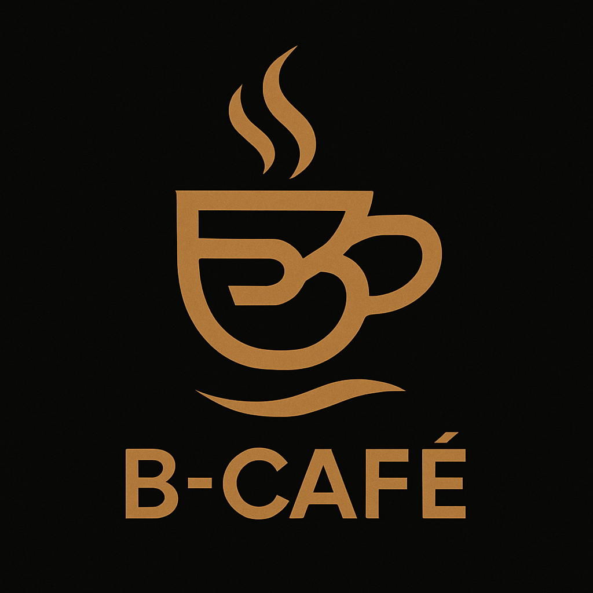

# ☕ B-Cafe API Project
<p align="center">
  
</p>
<<<<<<< HEAD

=======
>>>>>>> 5425a88 (Update all apps)

Welcome to **B-Cafe**, a Django REST Framework-based API project designed to manage the digital menu, user system, and reservation flow of a modern café-restaurant.

---

## 🧩 Overview

This project provides a structured and scalable backend system that handles:

- 🍽️ **Cafe and Restaurant Menu**  
  Manage menu categories (food, drinks, desserts, etc.) and item details with price, stock, discount, and availability.

- 📅 **Table Reservation System**  
  Customers can reserve tables without logging in. Notifications are automatically sent to both customer and admin after reservation.

- 👥 **User Authentication & Role Management**  
  Supports multiple user roles including Admin, Cashier, Waiter, and Customer with JWT-based authentication and custom permissions.

- 🧾 **Order Management System**  
  Allows customers to place orders, waiters to continue orders, and cashiers to mark orders as paid. Admins have full access.

- 📞 **Contact & Info Pages**  
  Includes an About Us and Contact Us section for showing café information and handling user messages.

- 🔍 **Search & Filter Functionality**  
  Powerful filtering, searching, and ordering capabilities using DRF’s backend filters.

- 🧠 **Smart Logic with Signals & Validators**  
  Handles dynamic stock updates, order emails, password validation, and more using Django signals and validators.

---

## 🔧 Features

### 🍽️ Menu & Reservations
- Add/edit/delete menu items with categories
- Live discount support with start/end dates
- Menu item status (`Available` / `Out of Stock`) auto-managed
- Table reservation with optional birthday designs & notes
- Admin approval system for reservations
- Auto email notifications on reservation

### 👥 User System & Authentication
- JWT-based login & registration
- Custom user model (`CustomUser`) with role field
- User roles:
  - `admin`: Full access
  - `cashier`: See/mark orders as paid, view menu & stock
  - `waiter`: See/continue orders, view reservations & menu
  - `customer`: View menu, place orders, manage own profile
- Role-based permissions for all views
- Secure password change (with old password check)
- Unique email validation on signup
- Signals:
  - Welcome email on registration
- OTP system placeholder for future SMS/email verification
- Purchase History model placeholder

### 🧾 Orders
- Order & OrderItem models with connection to user and menu
- Calculate total price with active discounts
- Prevent over-ordering with real-time stock validation
- Stock auto-decreased when ordering, increased on delete
- Orders can be filtered and viewed based on user role
- Send confirmation email on payment

### 💬 API Behavior
- Clean RESTful endpoints
- Custom base view class for shared behavior (`BaseAPIView`)
- Token returns username and role
- Protected endpoints with role-specific access

---

## 📦 Technologies Used

- 🐍 Python 3.x  
- 🕸️ Django 4.x  
- ⚙️ Django REST Framework  
- 🔎 Django Filter  
- 🐳 Docker & Docker Compose  
- 📨 SMTP Email for notifications

---

## 📁 Apps Structure

- `menu` – Menu items, categories, discount handling  
- `reservation` – Table reservation system  
- `users` – Authentication, roles, profile, password management  
- `orders` – Order placement and role-based access logic  
- `info` – About Us & Contact Us pages  
- `utility` – Common views, custom permissions, base models

---

## 🚀 Getting Started

### ✅ Backend Setup

```bash
git clone https://github.com/Behnoushin/B-Cafe-digital-menu
cd Charity-Project

# Create virtual environment
python3 -m venv venv
source venv/bin/activate  # On Windows: venv\Scripts\activate

# Install dependencies
pip install -r requirements.txt

# Run migrations
python manage.py migratea

# Start development server
python manage.py runserver
```

Crafted with ❤️ by Behnoushin (Behnoush Shahraeini)
